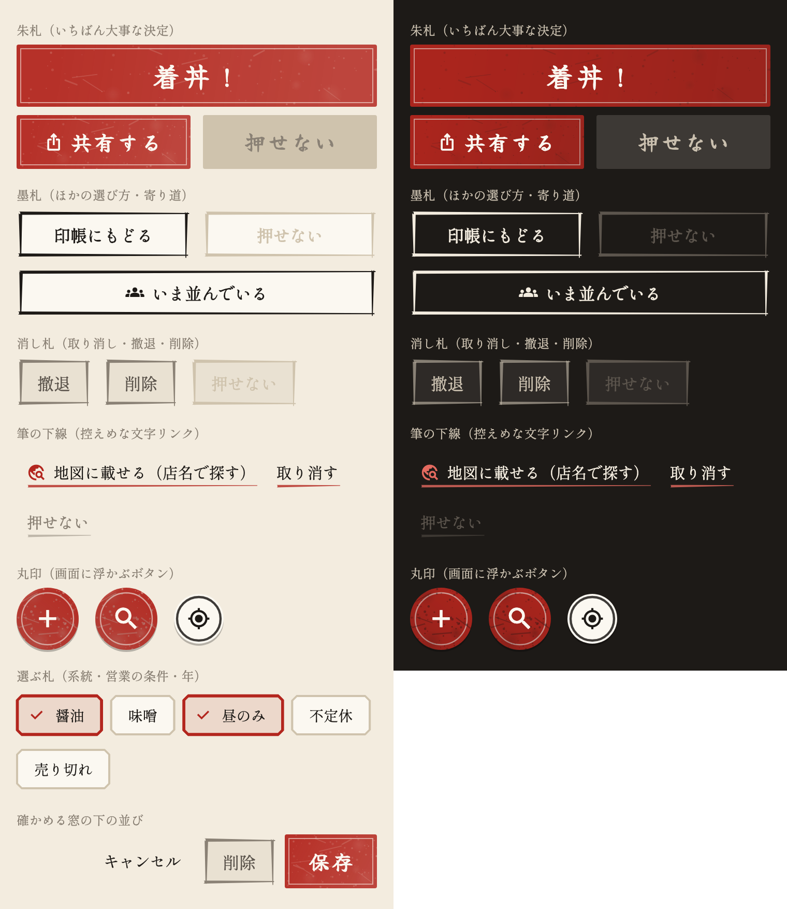

# ボタンの見本帳

アプリのボタンを、役割ごとに見比べるための見本（確認用）。左が和紙の画面、右が墨色の画面（着丼直後の画面・並び中の帯）。

| 見た目 | 役割 | 使っているところ |
|---|---|---|
| 朱札（朱塗りの地に和紙色の細い枠、筆文字） | その画面でいちばん大事な決定 | 着丼！・保存・共有する・並んだ・願を掛ける・書き出す |
| 墨札（筆で4辺を引いた枠） | ほかの選び方・別の画面への寄り道 | 印帳にもどる・いま並んでいる・カメラで撮る／ギャラリーから選ぶ・この店のページを見る・その一杯を見る・読み込む・もう一度探す |
| 消し札（灰の地に薄墨の枠） | 取り消し・撤退・削除 | 撤退・撤退を記録・削除・やめる・取り消す（確かめる窓） |
| 筆の下線（朱の筆で下線を引いた文字） | 控えめな寄り道 | 地図に載せる・全国の店から探す・撮り直す・旅路を再生・遠征・叶えた・願を掛ける（思い出）・取り消す（並び中の帯） |
| 丸印（朱の丸に内側の輪／和紙に墨の輪） | 画面に浮かぶボタン | ＋・このあたりを探す・現在地（墨の輪） |
| 選ぶ札（角を落とした木札、選ぶと朱の縁とチェック） | 系統・営業の条件・年などを選ぶ | 記録・編集・修行録・地図の旅路・一年の振り返り・撤退の理由 |

- 部品は `lib/theme/washi_buttons.dart`、選ぶ札とほかの既定のボタンの色は `lib/theme/app_theme.dart`
- 画面上部の小さなアイコン・★・閉じる（×）・確かめる窓の「キャンセル」は、わかりやすさを優先して文字やアイコンだけのまま
- ボタンの見た目を変えたら `flutter test --dart-define=UPDATE_BUTTON_CATALOG=true test/tool/button_catalog_test.dart` で画像を作り直す
